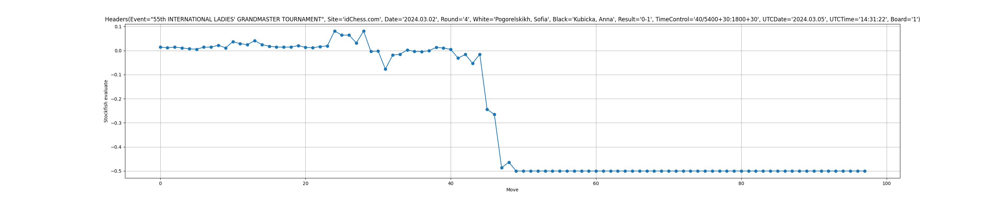

# Определение интересных ситуаций в шахматной партии

Этот проект предоставляет инструменты для анализа шахматных партий в формате PGN (Portable Game Notation) с использованием шахматного движка Stockfish для оценки позиций. Анализатор также определяет интересные моменты в партиях на основе анализа и связывает их с временными метками из видео партии.

### Класс ChessGame

Класс `ChessGame` представляет шахматную партию с ее метаданными.

### Класс Move

Класс `Move` представляет один шахматный ход с его номером и временной меткой видео.

### Класс InterestingMoment

Класс `InterestingMoment` представляет коллекцию ходов, образующих интересный момент в партии.

### Класс GameEvaluationResult

Класс `GameEvaluationResult` инкапсулирует результат оценки партии, включая имя файла PGN, ID партии и интересные моменты.

### Класс PGNAnalyzer

Класс `PGNAnalyzer` предоставляет методы для парсинга, анализа и извлечения интересных моментов из PGN файлов с использованием Stockfish и связывает их с временными метками из видео.

### Отчет анализатора шахматных партий

Отчет анализатора представляет собой таблицу, содержащую информацию о каждом ходе в анализируемой шахматной партии. Таблица включает в себя следующие столбцы:

- `id`: Порядковый номер хода.
- `Move`: Запись хода в шахматной нотации.
- `Timestamp`: Временная метка в миллисекундах, когда был сделан ход.
- `Time on clock`: Оставшееся время на часах игрока в формате `HH:MM:SS`.
- `Score`: Оценка позиции после сделанного хода, представленная в виде `PovScore`, показывающая ценность позиции для белых или черных.
- `ScoreWhite`: Вероятность выигрыша для белых после хода.
- `ScoreBlack`: Вероятность выигрыша для черных после хода.
- `ScoreRelative`: Относительная оценка позиции (положительное значение для преимущества белых, отрицательное - для черных).
- `ScoreValue`: Оценка позиции (единицах измерения шахматного преимущества).
- `Best Move`: Лучший возможный ход в данной позиции, предложенный движком Stockfish.
- `df_score`: Разница в оценке позиции после текущего хода по сравнению с предыдущим.

## Пример использования

```python
analyser = PGNAnalyzer("path_to_pgn_file.pgn",
                               game_id,
                               stockfish_path='path_to_stockfish_executable.exe',
                               video_path='path_to_video_file.mp4',
                               metatool_path='path_to_exiftool_executable.exe')

        df = analyser.analyze_game(analyser.game)
        interesting_moves = analyser.get_interesting_moves(df)
```



Значение функции выше 0 указывает на преимущество белых, а ниже нуля, соответственно, на преимущество черных


### Пример содержимого отчета

| id | Move  | Timestamp      | Time on clock | Score                          | ScoreWhite | ScoreBlack | ScoreRelative | ScoreValue | Best Move | df_score  |
|----|-------|----------------|---------------|--------------------------------|------------|------------|---------------|------------|-----------|-----------|
| 0  | e2e4  | 1709649082410  | 01:30:29      | PovScore(Cp(+33), WHITE)       | 0.514      | 0.486      | +33           | 33         | e2e4      |           |
| 1  | e7e5  | 1709649120905  | 01:29:51      | PovScore(Cp(-30), BLACK)       | 0.5115     | 0.4885     | -30           | -30        | c7c5      | 0.0025    |
| 2  | g1f3  | 1709649131077  | 01:30:49      | PovScore(Cp(+33), WHITE)       | 0.514      | 0.486      | +33           | 33         | g1f3      | 0.0025    |
| 3  | b8c6  | 1709649139529  | 01:30:13      | PovScore(Cp(-29), BLACK)       | 0.511      | 0.489      | -29           | -29        | b8c6      | 0.0030    |
| 4  | f1b5  | 1709649153444  | 01:31:05      | PovScore(Cp(+21), WHITE)       | 0.507      | 0.493      | +21           | 21         | d2d4      | 0.0040    |
| 5  | a7a6  | 1709649162173  | 01:30:34      | PovScore(Cp(-18), BLACK)       | 0.5055     | 0.4945     | -18           | -18        | a7a6      | 0.0015    |
| 6  | b5a4  | 1709649175808  | 01:31:21      | PovScore(Cp(+33), WHITE)       | 0.514      | 0.486      | +33           | 33         | b5a4      | 0.0085    |

## Описание модуля по оценке шахматных дебютов

PGNHelper - это утилита для анализа шахматных партий в формате PGN (Portable Game Notation) с использованием базы данных шахматных дебютов ECO (Encyclopedia of Chess Openings). Программа позволяет добавлять информацию о дебютах и транспозициях в шахматные партии, а также определять ключевые ходы в начале игры.

#### Функциональность
PGNHelper предоставляет следующие возможности:
1. **Поиск данных о дебюте**: Программа ищет данные о дебюте в базе данных ECO по коду ECO, имени дебюта и его вариациям.
2. **Определение базовых ходов**: Определяет основные ходы дебюта или транспозиции, используя максимальное количество ходов из базы данных.
3. **Добавление информации о дебюте**: Информация о дебюте и транспозициях добавляется в исходный PGN-файл.

#### Использование
Для использования PGNHelper необходимо импортировать модуль `pgnhelper.app` и создать экземпляр класса `PgnHelper`, передав необходимые параметры.

### Пример
Рассмотрим пример с файлом `Round_1.pgn`, который содержит несколько шахматных партий. Мы хотим добавить информацию о дебютах из базы данных `eco.pgn` и сохранить результат в файл `Round1_with_opening.pgn`.

После выполнения этой команды в файл `Round1_with_opening.pgn` будут добавлены данные о дебютах и транспозициях для каждой партии, что позволит более подробно анализировать и изучать шахматные ходы.

### Заключение
PGNHelper - это мощный инструмент для шахматистов и аналитиков, который автоматизирует процесс добавления информации о дебютах в шахматные партии, облегчая анализ и обучение. Использование базы данных ECO позволяет быстро и точно определить ключевые ходы и варианты в начале игры.
## Модуль видеомонтажа

### Описание работы программы для обработки видео

Модуль предназначен для обработки видео, включающей добавление текста, музыки, создание вступительного фрагмента и объединение различных фрагментов видео в одно целое.

### Входные данные для создания видеоролика
Программа для обработки видео использует входные данные, которые описывают интересные моменты шахматной партии. Эти данные представлены в виде классов Move, InterestingMoment и GameEvaluationResult. Ниже приведено подробное описание этих классов и их полей.

### Основные этапы работы программы

1. Создание вступительного фрагмента

2. Обработка фрагментов видео
   
3. Объединение фрагментов видео

4. Удаление звуковой дорожки

5. Добавление музыки

6. Удаление временных файлов
